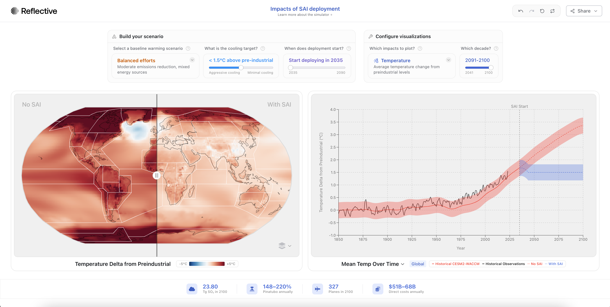

# sai-simulator
[](https://doi.org/10.5281/zenodo.14510645)

Official repository for [the SAI Simulator](https://simulator.reflective.org/), a new tool to explore the effects of stratospheric aerosol injection on the climate.



## Table of Contents
- [Introduction](#introduction)
- [Data Preparation](#-data-preparation)
  - [Environment Setup](#a-environment-setup)
  - [Data Download](#b-data-download)
  - [Data Processing](#c-data-processing)
  - [Fit the Regression Models](#d-fit-the-regression-models)
  - [Cache the Data](#e-cache-the-data)
- [License](#-license)
- [Citation](#%EF%B8%8F-citation)

## Introduction
The SAI Simulator is a web-based tool that runs in your browser at [simulator.reflective.org](https://simulator.reflective.org/). If you would like to reproduce the steps to prepare the data presented in the simulator, you can follow the instructions below.

## 📁 Data Preparation

### A. Environment Setup
Create a new conda environment and install the required packages by running the following commands:
```bash
conda create -n sai-simulator python=3.11 esmpy=8.6.1 -c conda-forge
conda activate sai-simulator
pip install -r requirements.txt
```

### B. Data Download
Download the GAUSS data from Globus (requires around 140GB of disk space):
1. First install the [Globus CLI](https://docs.globus.org/cli/):
    ```bash
    pip install globus-cli
    ```
2. Log in to Globus:
    ```bash
    globus login
    ```
3. Download the data:
    ```bash
    sh scripts/download_gauss.sh 2e01e83a-5180-47f7-a6ab-c98b626ad9e4 <YOUR ENDPOINT ID> data/gauss/
    ```

### C. Data Processing
1. Process the daily data to create monthly values. You can process all the daily data (both `tas` and `pr`) using:
    ```bash
    sh scripts/process_all_daily.sh data/gauss
    ```
    Or you can process the daily data for a specific variable (e.g. `tas`) using:

    ```bash
    python scripts/process_daily_gauss.py --var tas --data_dir data/gauss
    ```

2. Process the monthly data to create annual values ready for model fitting. You can process all the monthly data using:
    ```bash
    sh scripts/process_all_monthly.sh data/gauss data/processed
    ```
    Or you can process the monthly data for a specific variable using:
    
    ```bash
    python scripts/process_monthly_gauss.py  --var tas --data_dir data/gauss --output_dir data/processed
    ```

    Although not necessary, to visualize the processed monthly data for a specific variable in different years, run:
    ```bash
    python scripts/visualize_monthly_gauss.py --var tas --year 2042 --data_dir data/processed
    ```

### D. Fit the Regression Models
We fit linear regression models to (1) estimate a gridded map of each variable given a global temperature output by [FaIR](https://github.com/OMS-NetZero/FAIR) and (2) estimate a gridded delta of each variable given a global temperature delta. The models are trained using the GAUSS simulation data.

You can fit the regression models for all variables using:
```bash
sh scripts/fit_all.sh data/processed data/models
```

Or you can fit the regression models for a specific variable using:
```bash
python scripts/fit_map.py --var tas --data_dir data/processed --output_dir data/models
python scripts/fit_delta.py --var tas --data_dir data/processed --output_dir data/models
```

Although not necessary, to visualize the range, IQR, and mean of the linear regression models that estimate a gridded map of each variable given a global temperature output by [FaIR](https://github.com/OMS-NetZero/FAIR) for a variable, run:
```bash
python scripts/visualize_map_fit.py --var tas --model CESM2-WACCM --model_dir data/models --data_dir data/processed
```   

### E. Cache the Data
The simulator caches all the data to be loaded more efficiently by the frontend. You can cache the data by running the following command:
```bash
python scripts/cache.py --data_dir data/processed --model_dir data/models --output_dir data/cache
```

## 🔒 License
This project is released under the Apache 2.0 License - see the [LICENSE](https://github.com/reflective-org/sai-simulator/blob/main/LICENSE) file for details.

## ✏️ Citation
If you use the SAI Simulator in your work, please cite the following:

```
Jeremy Irvin, Jake Dexheimer, Dakota Gruener, Charlotte DeWald, Daniele Visioni, Duncan Watson-Parri, Douglas MacMartin, Joshua Elliott, Juerg Luterbacher, Kion Yaghoobzadeh. (2024). SAI Simulator (Version 1.0.0) [Software]. Available at GitHub: https://github.com/Reflective-org/sai-simulator. Hosted at: https://simulator.reflective.org and https://planetparasol.ai.  DOI: https://doi.org/10.5281/zenodo.11467175
```
