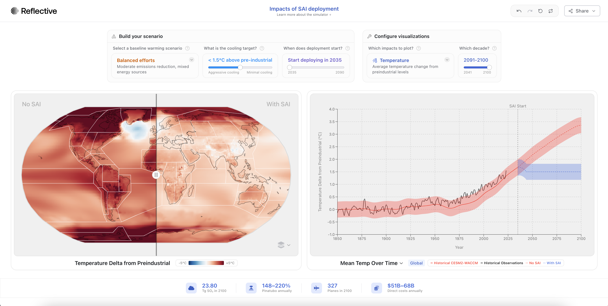

# sai-simulator

[](https://doi.org/10.5281/zenodo.15531372)

Official repository for [the SAI Simulator](https://simulator.reflective.org/), a new tool to explore the effects of stratospheric aerosol injection on the climate.



## Table of Contents

- [Introduction](#introduction)
- [Setup Options](#setup-options)
- [Option 1: Automated Setup (Recommended)](#-option-1-automated-setup-recommended)
- [Option 2: Manual Setup](#-option-2-manual-setup)
  - [Environment Setup](#a-environment-setup)
  - [Data Download](#b-data-download)
  - [Data Processing](#c-data-processing)
  - [Fit the Regression Models](#d-fit-the-regression-models)
  - [Variability Calculation](#e-variability-calculation)
  - [Cache the Data](#f-cache-the-data)
- [License](#-license)
- [Citation](#%EF%B8%8F-citation)

## Introduction

The SAI Simulator is a web-based tool that runs in your browser at [simulator.reflective.org](https://simulator.reflective.org/). If you would like to reproduce the steps to prepare the data presented in the simulator, you can follow the instructions below.

## Setup Options

There are two ways to set up the SAI Simulator locally:

| Option | Description | Best For |
|--------|-------------|----------|
| **[Automated Setup](#-option-1-automated-setup-recommended)** | Interactive script that handles everything | Most users |
| **[Manual Setup](#-option-2-manual-setup)** | Step-by-step commands you run yourself | Advanced users who want full control |

Both options require ~140GB of disk space for data storage.

---

## 🚀 Option 1: Automated Setup (Recommended)

The automated setup script guides you through the entire installation process interactively. It asks all configuration questions up front, then executes the setup steps.

```bash
./setup.sh
```

The script will:

1. Ask all configuration questions up front (environment type, data directories, which steps to run)
2. Set up your Python environment (Conda or venv)
3. Optionally compile and install ESMF (default version: release/8.9.0)
4. Download ~140GB of data from S3
5. Process the data and fit regression models
6. Cache the data for the simulator

After setup completes, see the [Manual Setup](#-option-2-manual-setup) section for usage instructions.

---

## 📦 Option 2: Manual Setup

Use this option if you want full control over each step or need to troubleshoot specific parts of the setup.

### A. Environment Setup

We recommend using **Python 3.11** or higher (all code is tested using Python 3.12.12).

#### Option 1: Using Conda

Set up a new Conda environment and install required packages:

```bash
conda create -n sai-simulator python=3.12.12 -c conda-forge
conda activate sai-simulator
pip install -r requirements.txt
```

#### Option 2: Using venv (Standard Python Virtual Environment)

If you prefer to use `venv` instead of Conda, follow these steps:

```bash
python -m venv .venv
source .venv/bin/activate  # On Windows: venv\Scripts\activate
pip install --upgrade pip
pip install -r requirements.txt
```

#### Install ESMF Library (Required for both Conda and venv)

The SAI Simulator requires the ESMF (Earth System Modeling Framework) library to be compiled from source.

**Prerequisites:**

- gfortran: `brew install gcc`
- Xcode Command Line Tools: `xcode-select --install`

**Installation Steps:**

1. Clone the ESMF repository:

   ```bash
   git clone https://github.com/esmf-org/esmf.git
   cd esmf
   ```

2. Checkout a release branch (e.g., release/8.9.0):

   ```bash
   git checkout release/8.9.0
   ```

3. Clean previous builds and set up the build environment:

   ```bash
   make distclean
   export ESMF_DIR=$(pwd)
   export ESMF_BOPT=O
   export ESMF_CXX=/usr/bin/clang++
   export ESMF_C=/usr/bin/clang
   export ESMF_F90=gfortran
   export ESMF_COMPILER=gfortranclang
   export ESMF_SHARED_LIB_BUILD=ON
   export ESMF_CXXLINKLIBS="-lc++"
   export ESMF_F90LINKLIBS="-lc++"
   export ESMF_COMM=mpiuni
   ```

4. Build ESMF (this takes 10-20 minutes):

   ```bash
   make
   ```

5. Verify the libraries exist in `lib/libO/<os-system>/`:

   - `libesmf_fullylinked.dylib` (or `.so` on Linux)
   - `libesmf.dylib` (or `.so` on Linux)
   - `esmf.mk`

6. Set the ESMFMKFILE environment variable and add it to your shell configuration:

   ```bash
   export ESMFMKFILE=$(find $ESMF_DIR/lib/libO -name "esmf.mk" | head -1)
   echo "export ESMFMKFILE=\"$ESMFMKFILE\"" >> ~/.zshrc  # or ~/.bashrc
   source ~/.zshrc  # or ~/.bashrc
   ```

7. Install ESMPy:
   ```bash
   cd src/addon/esmpy
   python -m pip install .
   ```

### B. Data Download

Download the necessary data from AWS S3 bucket (requires around 140GB of disk space):

1. Create a data repository:
   ```bash
   mkdir -p data/raw
   ```
2. Download the data (takes about 30 minutes to 2 hours based on your internet speed):
   ```bash
   aws s3 sync s3://reflective-simulator-bucket/v1.3.0/ ./data/raw/ --no-sign-request
   ```
3. Download the LENS NCAR data for minimum and maximum temperature (please note that the `--overwrite` flag is optional):
   ```bash
   sh scripts/run_download_CESM_LENS.sh TREFHTMX monthly data/raw 001 002 003 --overwrite
   sh scripts/run_download_CESM_LENS.sh TREFHTMN monthly data/raw 001 002 003 --overwrite
   ```

### C. Data Processing

1. Process the daily data to create monthly values. You can process all the daily data (both `tas` and `pr`) using:

   ```bash
   sh scripts/process_all_daily.sh data/raw
   ```

   Or you can process the daily data for a specific variable (e.g. `tas`) using:

   ```bash
   python scripts/process_daily_gauss.py --var tas --data_dir data/raw
   ```

2. Process the monthly data to create annual values ready for model fitting. You can process all the monthly data using:

   ```bash
   sh scripts/process_all_monthly.sh data/raw data/processed
   ```

   Or you can process the monthly data for a specific variable using:

   ```bash
   python scripts/process_monthly_gauss.py  --var tas --data_dir data/raw --output_dir data/processed
   ```

3. Calculate model internal variability for sea ice by running the following command:

   ```bash
   python scripts/variability.py icefrac ./data/processed ./data/models
   ```

### D. Fit the Regression Models

We fit linear regression models to (1) estimate a gridded map of each variable given a global temperature output by [FaIR](https://github.com/OMS-NetZero/FAIR) and (2) estimate a gridded delta of each variable given a global temperature delta. The models are trained using the GAUSS simulation data.

You can fit the regression models for all variables using:

```bash
sh scripts/fit_all.sh data/processed data/models
```

Or you can fit the regression models for a specific variable using:

```bash
python scripts/fit_map.py --var tas --data_dir data/processed --output_dir data/models
python scripts/fit_delta.py --var tas --data_dir data/processed --output_dir data/models
```

### E. Variability calculation

To calculate grid cell level and global model internal variability, we need to run the variability script.

```bash
python scripts/variability.py --var_name icefrac --data_dir data/processed data/models
```

### F. Cache the Data

The simulator caches all the data to be loaded more efficiently by the frontend. You can cache the data by running the following command:

```bash
python scripts/cache.py --data_dir data/processed --model_dir data/models --output_dir data/cache
```

## 🔒 License

This project is released under the Apache 2.0 License - see the [LICENSE](https://github.com/reflective-org/sai-simulator/blob/main/LICENSE) file for details.

## ✏️ Citation

If you use the SAI Simulator in your work, please cite the following:

```
Ali Akherati, Susanne Baur, Charlotte DeWald, Jake Dexheimer, Alistair Duffey, Jared Farley, Dakota Gruener, Jeremy Irvin, Emily Kuhn, Douglas MacMartin, John Orcutt, Kate Pellegrino, Daniele Visioni, Duncan Watson-Parris, Kion Yaghoobzadeh. (2026). SAI Simulator (Version 1.3.0) [Software]. Available at GitHub: https://github.com/Reflective-org/sai-simulator. Hosted at: https://simulator.reflective.org and https://planetparasol.ai.  DOI: https://doi.org/10.5281/zenodo.15531372
```
